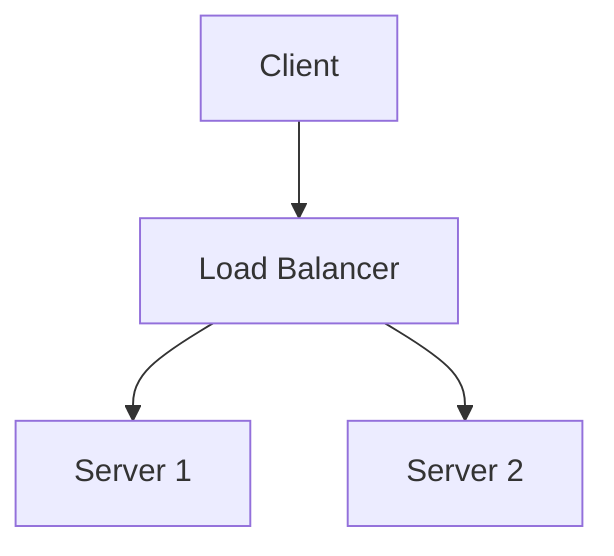

# Markdown to PDF Converter Skill

Convert Markdown files to PDF with full Mermaid diagram support using the md2pdf-mermaid tool.

## Prerequisites

This skill requires the `md2pdf-mermaid` Python package to be installed:

```bash
pip install md2pdf-mermaid
playwright install chromium
```

## Skill Instructions

When the user asks to convert a Markdown file to PDF, follow these steps:

### Step 1: Verify Prerequisites

Check if md2pdf-mermaid is installed:

```bash
md2pdf --version
```

If not installed, inform the user and provide installation instructions.

### Step 2: Identify the Target File

- If the user specifies a file, use that file path
- If no file is specified, check if there's a currently open Markdown file
- Ask the user which file to convert if unclear

### Step 3: Determine Output Options

Ask the user for preferences (or use defaults):
- **Output directory**: Same directory as source file (default) or custom path
- **PDF format**: a4 (default), Letter, Legal, A3, A5, Tabloid
- **Custom title**: Optional title for the PDF
- **Margins**: Default is 20mm all sides

### Step 4: Build and Execute Command

Construct the md2pdf command with the appropriate options:

```bash
md2pdf <input-file> -o <output-file> [--title "Title"] [--page-size FORMAT]
```

Example commands:
```bash
# Basic conversion
md2pdf document.md

# Custom output name
md2pdf document.md -o report.pdf

# With title and page size
md2pdf document.md --title "Project Report" --page-size Letter
```

### Step 5: Execute and Report

- Execute the command using the `execute_command` tool
- Monitor for errors
- Report success and provide the path to the generated PDF
- Offer to open the PDF file

## Common Options

### Page Sizes
- `a4` (default) - 210mm × 297mm
- `Letter` - 8.5in × 11in
- `Legal` - 8.5in × 14in
- `a3` - 297mm × 420mm
- `a5` - 148mm × 210mm
- `Tabloid` - 11in × 17in

### Command Flags
- `-o, --output` - Output file path
- `--title` - Document title
- `--page-size` - Page format (A4, Letter, etc.)
- `--landscape` - Use landscape orientation
- `--no-toc` - Disable table of contents
- `--help` - Show all available options

## Example Workflows

### Simple Conversion
```
User: "Convert README.md to PDF"

1. Check if md2pdf is installed
2. Execute: md2pdf README.md
3. Report: "PDF created: README.pdf"
```

### Custom Output
```
User: "Convert docs/guide.md to PDF with title 'User Guide' in Letter format"

1. Check if md2pdf is installed
2. Execute: md2pdf docs/guide.md -o docs/user-guide.pdf --title "User Guide" --page-size Letter
3. Report: "PDF created: docs/user-guide.pdf"
```

### Batch Conversion
```
User: "Convert all markdown files in docs/ to PDF"

1. List all .md files in docs/
2. For each file, execute: md2pdf <file>
3. Report summary of converted files
```

## Mermaid Diagram Support

The tool automatically renders Mermaid diagrams. Supported diagram types:
- Flowcharts
- Sequence diagrams
- Class diagrams
- State diagrams
- Entity relationship diagrams
- Gantt charts
- Pie charts
- Git graphs

Example Markdown with Mermaid:
````markdown
# System Architecture


````

## Error Handling

### "md2pdf: command not found"
- Inform user to install: `pip install md2pdf-mermaid`
- Provide installation link: https://github.com/rbutinar/md2pdf-mermaid

### "Playwright browser not found"
- Inform user to install browser: `playwright install chromium`

### File not found
- Verify the file path exists
- Suggest using `list_files` to find the correct path

### Permission errors
- Check file permissions
- Suggest using a different output directory

## Tips

1. **Always use absolute or relative paths** from the current working directory
2. **Quote file paths** with spaces: `md2pdf "My Document.md"`
3. **Check output** before confirming success
4. **Preserve Mermaid syntax** - the tool handles rendering automatically
5. **Test with example.md** first if user is unsure

## Activation

This skill is activated when the user:
- Asks to "convert markdown to PDF"
- Mentions "md2pdf" or "PDF conversion"
- Asks to "export markdown"
- Requests "PDF with Mermaid diagrams"

## Success Criteria

- PDF file is created successfully
- Mermaid diagrams are rendered correctly
- File is in the expected location
- User is informed of the output path